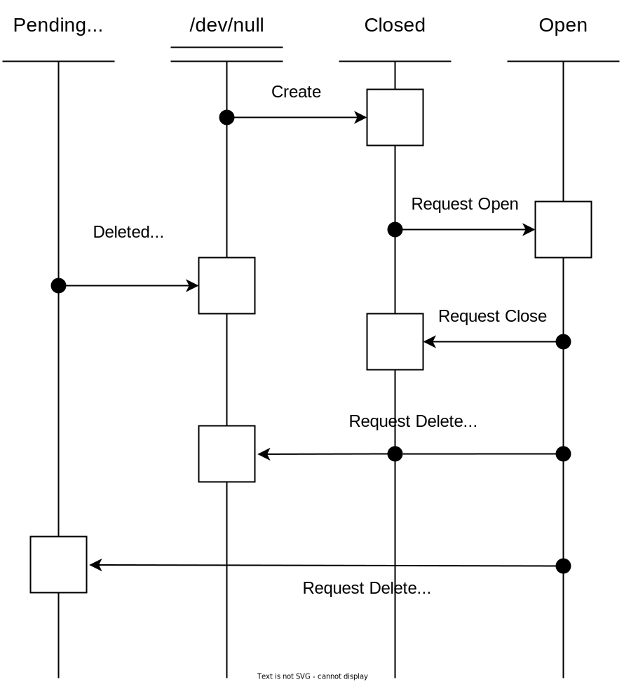
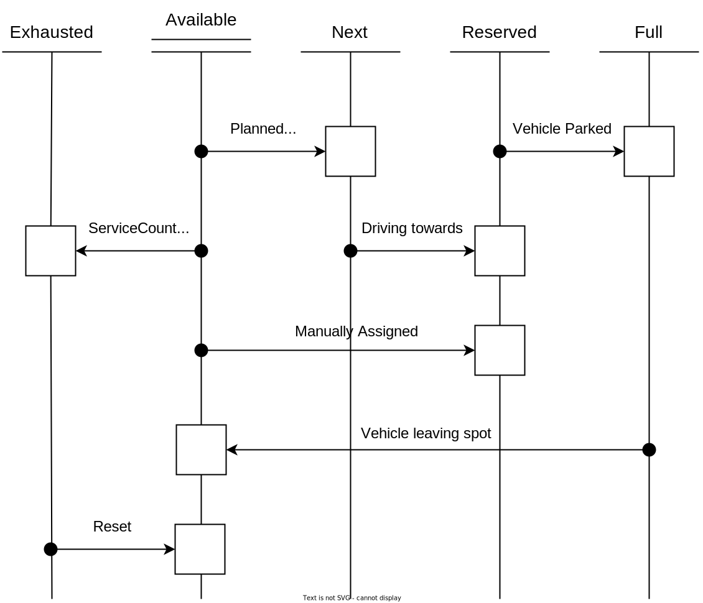

# Diagrams

You will find below sequence diagrams and state machine diagrams to understand the spot service of Open-Autonomy
- [Sequence Diagrams](#sequence-diagrams)
- [State Machines](#state-machines)

---

 

# Sequence Diagrams
###  [Happy flow](HappyFlow.md)

---

 

# State Machines

### Place State Machine

| State | Description |
|-------|-------------|
| `Closed` | A user would close a place to prevent the system from sending autonomous vehicles there; but intends on re-opening it later.  Obviously if there is no intension of re-using that place later, then it should be deleted. |
| `Open` | The Open state is when the place can be used by vehicles, and when the sub-state machine of the spot or queue is active. |
| `Pending Delete` | The pending delete state is a transition state that is awaiting for the release of the resource before finally discarding it. |

### Spot State Machine

#### Purpose of each state
| State | Description |
|-------|-------------|
| `Available` | This spot is open but is not the next one to be dispensed by the spot service, there is another spot servicing this area that will be used before.  A dispatcher could assign a truck to that particular spot.  This is useful to park a particular truck in a particular maintenance spot and have someone dispatched to that location without having to hunt for that truck. |
| `Next` | This is an open spot that will be the next one to be dispensed by the spot service when a truck is requesting *Any* open spot in that destination.  There will only be one NEXT spot per [Parent&type] that is servicing a destination.  e.g. This means that if there are over the edge spots and paddock spots in one area, then there will be 2 spots in the Next substate, one of the over the edge type and one of the paddock dumping type. When multiple spots are open to serve a single source, then it’s useful to know which one will be used next. |
| `Reserved` | A vehicle has requested exclusive usage of this spot and the /spot server has granted it to that vehicle.  But the vehicle is on its way there and has not stopped at that location yet.  This also indicates that no other vehicle can use that spot.
| `Full` | A vehicle is immobilized in that spot and is doing executing its task there.  When the truck’s task is to interact with another vehicle, Full also indicates to the other vehicle (like a loading equipment) that the truck is ready and won’t move until it is told to do so.  The spot will remain full until the truck releases this resource.  This also indicates that no other vehicle can use that spot or will be successful at reserving it.
| `Exhausted` |  This is an optional state that is used to automatically “close” a spot until it gets “replenished” by an external agent.  This is useful for over the edge dumping where after a set number of dumps, you’d want a dozer to go cleanup, push material and renew the berm (windrow).  The same method could be used for paddock dumping and set a single usage for each dumping point, until a dozer flattens the new lift.  It could also be used by a shovel operator to constraint the number of trucks that the FMS will be dispatched to it before a long tram.  This is a user controlled way to tells the overall system (FMS, AHS, Spot) to expect a delay before the re-opening of that spot and use other spots in the meantime.  Without having a person continuously glued to a screen and close spots just in time after a truck has used it for a set amount of time. |

---

 
